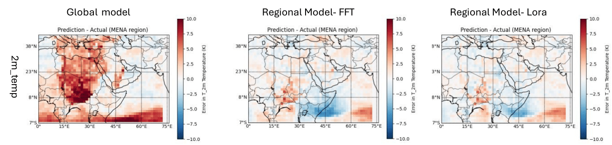

# Efficient Localized Adaptation of Neural Weather Forecasting: A Case Study in the MENA Region 

[Paper(arXiv)](TBA)

Authors: [Muhammad Akhtar Munir](https://scholar.google.com.pk/citations?user=sT-epZAAAAAJ&hl=en), [Fahad Shahbaz Khan](https://scholar.google.es/citations?user=zvaeYnUAAAAJ&hl=en), [Salman Khan](https://salman-h-khan.github.io/)

This repository contains the PyTorch implementation of Efficient Localized Adaptation of Neural Weather Forecasting: A Case Study in the MENA Region

## Abstract
Accurate weather and climate modeling is critical for both scientific advancement and safeguarding communities against environmental risks. Traditional approaches rely heavily on Numerical Weather Prediction (NWP) models, which simulate energy and matter flow across Earth's systems. However, heavy computational requirements and low efficiency restrict the suitability of NWP, leading to a pressing need for enhanced modeling techniques. Neural network-based models have emerged as promising alternatives, leveraging data-driven approaches to forecast atmospheric variables. In this work, we focus on limited-area modeling and train our model specifically for localized region-level downstream tasks. As a case study, we consider the MENA region due to its unique climatic challenges, where accurate localized weather forecasting is crucial for managing water resources, agriculture and mitigating the impacts of extreme weather events. This targeted approach allows us to tailor the model's capabilities to the unique conditions of the region of interest. Our study aims to validate the effectiveness of integrating parameter-efficient fine-tuning (PEFT) methodologies, specifically Low-Rank Adaptation (LoRA) and its variants, to enhance forecast accuracy, as well as training speed, computational resource utilization, and memory efficiency in weather and climate modeling for specific regions.



Error/Bias in Predictions and Actual measurements for temperature\_2m (K). Dated, 11th April 2017, lead time 3 days

| **Metric**                       | **Model**  | **geop@500** | **2m_temp** | **r_hum@850** | **s_hum@850** | **temp@850** | **10m_u_wind** | **10m_v_wind** |
|----------------------------------|------------|---------------|--------------|----------------|---------------|---------------|-----------------|-----------------|
| **ACC** (↑)                      | Global     | 0.292         | 0.230        | 0.255          | 0.282         | 0.246         | 0.287           | 0.238           |
|                                  | Regional   | 0.585         | 0.804        | 0.502          | 0.623         | 0.620         | 0.570           | 0.517           |
| **RMSE** (↓)                     | Global     | 674.295       | 3.349        | 23.308         | 0.003         | 3.561         | 3.733           | 4.162           |
|                                  | Regional   | 411.125       | 1.518        | 18.945         | 0.002         | 2.366         | 2.931           | 3.219           |


## Citation

Please cite the following, if you find this work useful in your research:

```bibtex

```

## Contact
In case of any query, create issue or contact akhtar.munir@mbzuai.ac.ae 

## Acknowledgement
This codebase is built on <a href="https://github.com/microsoft/ClimaX">ClimaX</a>


